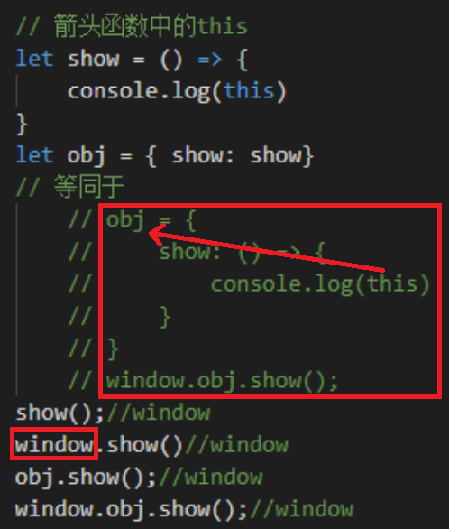

# this的概念：

- 在js中，this的意思为“这个;当前”，是一个指针型变量，它动态指向当前函数的运行环境。
- 在不同的场景中调用同一个函数，this的指向也可能会发生变化，但是它永远指向其所在函数的真实调用者；如果没有调用者，就指向全局对象window。

``` 
    普通函数：关于this，谁调用就指向谁，没有调用者，就指向全局对象window。
    箭头函数：箭头函数的this指向于函数作用域所用的对象。
```
## 普通函数
1. 全局环境下的this指向
   - 在全局作用域下，this始终指向全局对象window，无论是否是严格模式！


2. 函数内的this
   - 普通函数内的this分为两种情况，严格模式下和非严格模式下。
     - 严格模式下：直接test()调用函数,this指向undefined，window.test()调用函数this指向window。因此，在严格模式下， 我们对代码的的调用必须严格的写出被调用的函数的对象，不可以有省略或者说简写。

     - 非严格模式下：非严格模式下，通过test()和window.test()调用函数对象，this都指向window。


3. 对象中的this
   - 对象内部方法的this指向调用这些方法的对象，也就是谁调用就指向谁。
   - 一层对象：

   - 调用obj.skill()方法，返回值为蒙犽，说明此时this指向obj。 
   - 二层对象：

   - 调用skill2()方法的顺序为，obj.obj2.skill2() ,返回值为鲁班，说明skill2()方法中的this指向obj2。

### 总结：
1. 函数的定义位置不影响其this指向，this指向只和调用函数的对象有关。
2. 多层嵌套的对象，内部方法的this指向离被调用函数最近的对象。

## 箭头函数中的this
- 箭头函数的重要特征：箭头函数中没有this和arguments，是真的没有！
- 箭头函数没有自己的this指向，它会捕获自己定义所处的外层执行环境，并且继承这个this值,指向当前定义时所在的对象。箭头函数的this指向在被定义的时候就确定了，之后永远都不会改变。即使使用call()、apply()、bind()等方法改变this指向也不可以。

例子1：

- 声明的是全局变量Obj，this指向箭头函数所在全局作用域的对象，即indow对象。
例子2：

- 由于show函数是箭头函数，所以自身不能绑定this，因此找它的上一级作用域。如果父级作用域还是箭头函数，就再往上找，一层一层的直到直到this的指向。
- window.show()返回值是window，所以this此时指向window；
- window.obj.show(),obj是对象，非箭头函数，所以找到这里就停止了，this绑定到obj上。window调用obj，所以obj中的this也指向window。

## 构造函数中的this
- 构造函数中的this是指向实例。

- 由上图可以看出，构造函数中的this指向构造函数下创建的实例。